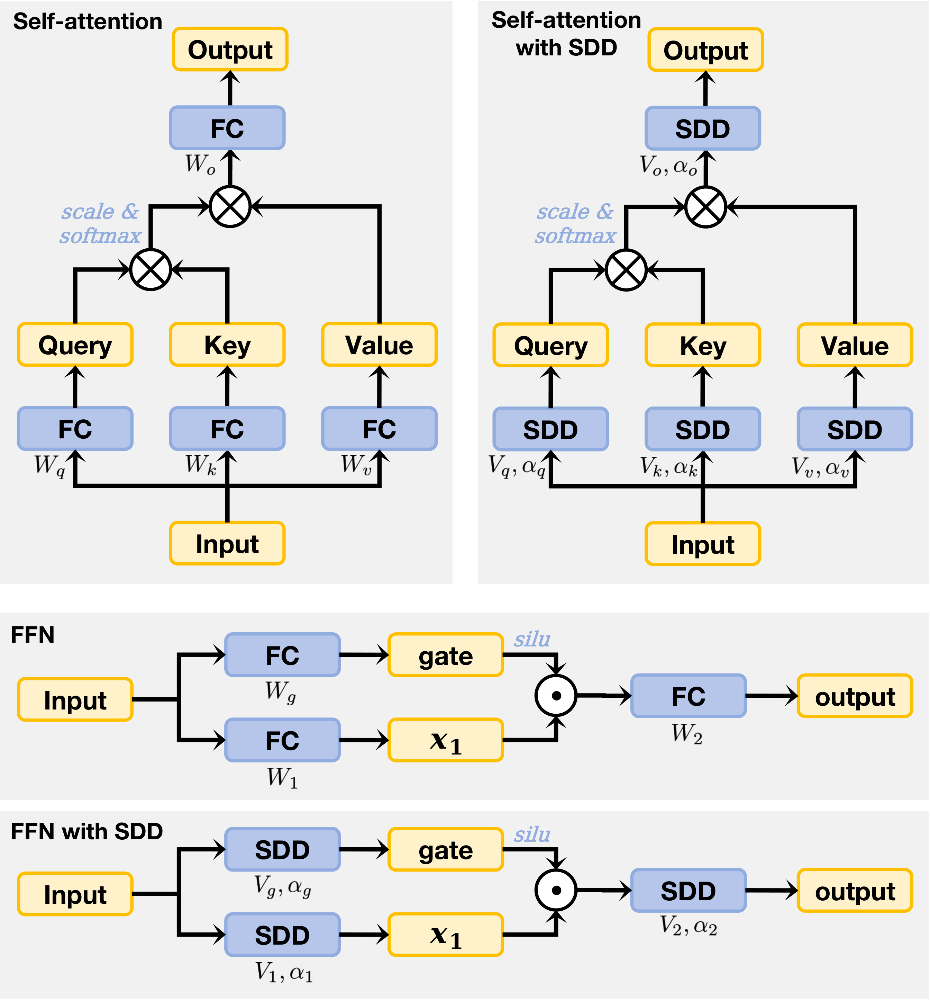

# Scale-Distribution Decoupling (SDD)

This repository contains the official implementation of **Scale-Distribution Decoupling (SDD)**, a novel method developed to stabilize the training of large language models (LLMs) by effectively preventing **gradient explosion and dissipation**. By decoupling the scale and distribution of the fully connected layer weights, SDD not only enhances training robustness but also accelerates convergence and improves optimization efficiency. These benefits are particularly evident in deep Transformer-based models, especially in postnorm-based configurations.
<div align="center">
  
  <p></p>
</div>

## Updates
- [02/18/25] Code release for Scale-Distribution Decoupling (SDD) applied to LLMs.
- [02/18/25] Paper temporarily released on arXiv.

## Usage
This repository contains the implementation of Scale-Distribution Decoupling (SDD) for stabilizing and improving the training of large language models. The main components of the repository are organized into directories as follows:
- [dense/](/dense/): Contains implementations of dense models used in experiments.
- [moe/](moe/): Implements the Mixture of Experts (MoE) models used in experiments.


### Installation
To install the necessary dependencies, run the following command:
```bash
python3 -m pip install -r requirements.txt
```

### Datasets

We use the **OLMoE-mix-0924** dataset, which can be downloaded from [here](https://huggingface.co/datasets/allenai/OLMoE-mix-0924). After downloading, use the following command to convert the dataset into the format required by our model:
```python
dolma tokens \
--documents ${PATH_TO_DOWNLOADED_DATA} \
--destination ${PATH_WHERE_TO_SAVE_TOKENIZED_DATA} \
--tokenizer.name_or_path 'allenai/gpt-neox-olmo-dolma-v1_5' \
--max_size '2_147_483_648' \
--seed 0 \
--tokenizer.eos_token_id 50279 \
--tokenizer.pad_token_id 1 \
--processes ${NUMBER_OF_CPU_CORES_TO_USE}
```

### Training
To train a large language model using Scale-Distribution Decoupling, execute the following command:
```bash
cd dense    # for dense experiments
# cd moe    # for MoE experiments
bash run.sh
```
Training metrics, including loss, accuracy, and other relevant indicators, will be displayed and tracked via wandb-service.

For ease of understanding and comparison, the SDD model and the baseline model are encapsulated in two separate branches. You can use git diff to inspect the differences between the two models:
- To switch to the baseline model branch, run:
    ```bash
    git checkout baseline
    ```
- To switch to the SDD model branch, run:
    ```bash
    git checkout sdd
    ```
- To directly compare the implementations of SDD and the baseline:
    ```bash
    git diff sdd baseline
    ```

### Usage in Other Frameworks
To replace ***all*** Linear operations in your models, use the following **SDDLinear** class. This class combines the linear transformation with RMSNorm to stabilize training.
```python
class SDDLinear(torch.nn.Module):
    def __init__(self, input_hidden_size, output_hidden_size, bias=False, eps=1e-6):
        super(SDDLinear, self).__init__()
        self.linear = torch.nn.Linear(
            in_features=input_hidden_size,
            out_features=output_hidden_size,
            bias=bias)
        
        self.norm = torch.nn.RMSNorm(
            normalized_shape=output_hidden_size,
            eps=eps,
            elementwise_affine=True)

    def forward(self, x):
        return self.norm(self.linear(x))
```

## Citing this work
If you find this work helpful or use it in your research, please consider citing our paper:
```bibtex
@article{wang2025scale,
  title={Scale-Distribution Decoupling: Enabling Stable and Effective Training of Large Language Models},
  author={Wang, Ya and Zhuo, Zhijian and Zeng, Yutao and Zhou, Xun and Yang, Jian and Li, Xiaoqing},
  journal={arXiv preprint arXiv:2502.15499},
  year={2025}
}
```

## Acknowledgement
Our work is based on the following repositories:
- [OLMo](https://github.com/allenai/OLMo)
- [OLMoE](https://github.com/allenai/OLMoE)

Thank you for your interest in our work. We hope our contributions to large language model research provide valuable insights and tools for the research community.